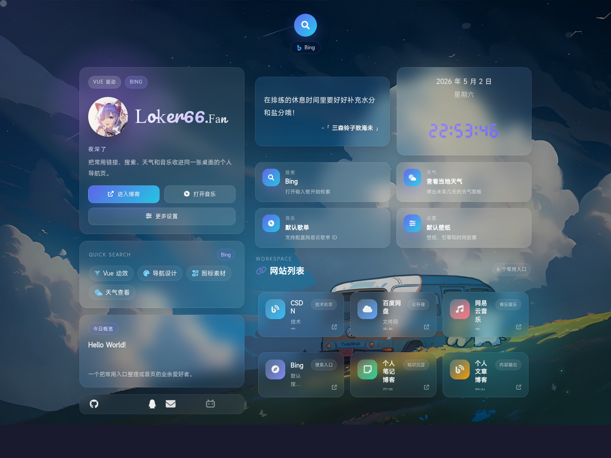

# MyIndex

一个基于 Vue 3 和纯静态资源构建的个人导航首页。

这个项目适合直接部署到静态托管平台，目标是把搜索、常用链接、天气、音乐播放器、壁纸切换和响应式布局整合到同一个首页中，在不引入构建链路的前提下提供更完整的交互体验。

## 预览



## 当前特性

- 基于 Vue 驱动的单页首页
- 搜索弹层、搜索引擎切换与自定义搜索引擎
- 快速搜索预设词
- 常用网站卡片导航
- 实时时间与一言展示
- 基于 `wttr.in` 的天气弹窗
- 支持网易云歌单 ID 配置的音乐播放器
- 壁纸切换与本地持久化
- 面向移动端的布局和交互优化

## 技术栈

- Vue 3 全局构建版本
- 原生 JavaScript
- 自定义 CSS
- Bootstrap 栅格工具
- Font Awesome
- iziToast
- APlayer
- js-cookie

## 项目结构

```text
.
├── index.html
├── 404.html
├── css/
├── js/
├── img/
├── vendor/
├── docs/
├── assets/screenshots/
├── README.md
├── README.zh-CN.md
├── PROJECT_SUMMARY.md
├── CHANGELOG.md
├── VERSION
├── LICENSE
└── vercel.json
```

## 运行方式

项目不依赖构建工具。

直接使用任意静态服务器启动即可：

```bash
python3 -m http.server 8080
```

然后访问：

```text
http://localhost:8080
```

## 部署

适合部署到：

- GitHub Pages
- Vercel
- Netlify
- 任意静态托管平台

当前仓库远端已配置为 `loker66fan/loker66fan.github.io`，可直接作为 GitHub Pages 仓库维护。

## 自定义位置

- 页面结构与文案：`index.html`
- 页面主要逻辑：`js/app.js`
- 视觉样式：`css/theme.css`
- 默认壁纸与图标资源：`img/icon/`
- PWA 元信息：`manifest.json`

## 相关文档

- [English README](./README.md)
- [项目简介](./PROJECT_SUMMARY.md)
- [更新日志](./CHANGELOG.md)
- [技术文档](./docs/技术文档.md)
- [开发日志](./docs/开发日志.md)
- [学习日志](./docs/学习日志.md)

## 许可证

项目使用 [MIT License](./LICENSE) 发布。

当前代码库基于早期个人主页项目继续演化，并保留了对 `imsyy/home` 的来源说明；如再分发较大代码片段，建议一并保留相关归属信息。
